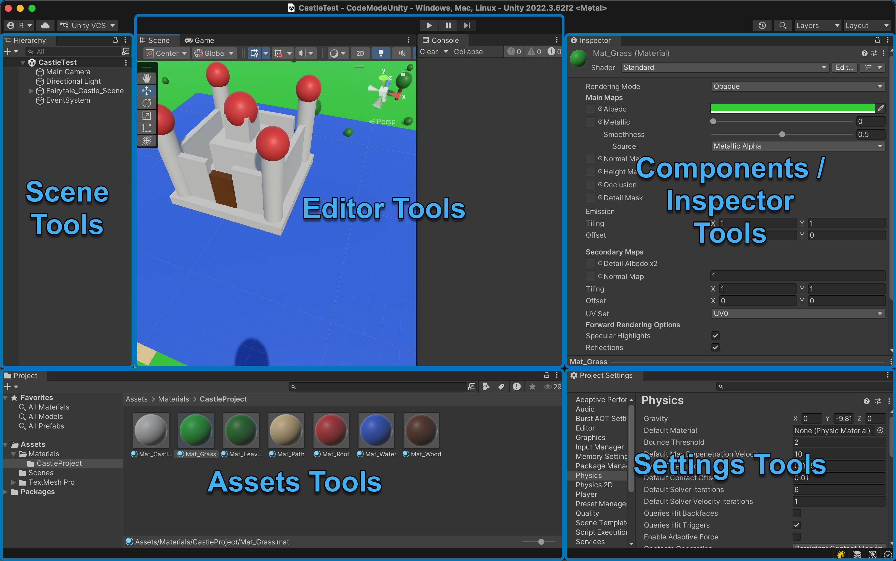

# Code Mode for Unity Editor

**Code Mode** turns the Unity Editor into an AI-controllable tool. It runs an HTTP server inside the editor that exposes scene manipulation, asset management, and property inspection as structured tool calls via [UTCP Protocol](https://www.utcp.io/) — letting AI agents build, inspect, and modify Unity projects the same way a developer would through the UI.
These tools are combined in [UTCP Code Mode](https://github.com/universal-tool-calling-protocol/code-mode/) environment to achieve maximum performance and token efficiency for AI agents, letting them call the tools in isolated JS sandbox.

## Quickstart

1. [Install extension](https://github.com/RomaRogov/unity-code-mode/tree/main?tab=readme-ov-file#installation) in the Unity project
2. [Integrate](https://github.com/RomaRogov/unity-code-mode/tree/main?tab=readme-ov-file#integration) extension with CodeMode MCP Server
3. Design a system prompt for you agent or use [provided example](https://github.com/RomaRogov/unity-code-mode/blob/main/prompt_example.md)
4. Ask AI to help you and see how it learns!

## Tools



| Category      | Tools | Purpose |
|---------------|-------|---------|
| **Scene**     | `GameObjectGetTree`, `GameObjectGetAtPath`, `GameObjectCreate`, `GameObjectCreatePrimitive`, `GameObjectOperate` | Navigate and build scene hierarchy |
| **Components** | `GameObjectComponentsGet`, `GameObjectComponentAdd`, `GameObjectComponentRemove`, `GameObjectGetAvailableComponentTypes` | Attach, remove, and discover components |
| **Inspector** | `InspectorGetInstanceDefinition`, `InspectorGetInstanceProperties`, `InspectorSetInstanceProperties` | Introspect types and read/write properties |
| **Assets**    | `AssetGetTree`, `AssetGetAtPath`, `AssetCreate`, `AssetImport`, `AssetOperate`, `AssetGetPreview` | Browse, create, and manage project assets |
| **Editor**    | `EditorOperate`, `EditorGetLogs`, `EditorGetScenePreview` | Control editor state and capture previews |
| **Settings**  | `SettingsGetDefinition`, `SettingsGetProperties`, `SettingsSetProperties` | Read and modify project settings |


## How It Works

**Code Mode** follows a **discover, then act** pattern. AI agents never guess at property names or component structures — they query for the real definitions first.

```
1. Get the scene tree         →  find the object you need
2. Get its type definition    →  learn its actual properties
3. Set properties by name     →  make precise changes
```

### Example

```typescript
// Find the camera
const tree = UnityEditor.GameObjectGetTree({});
const cameraTransform = tree.children[0].components[0]; // Transform ref

// Discover what properties Transform has
const def = UnityEditor.InspectorGetInstanceDefinition({ reference: cameraTransform });
// → "export class Transform { localPosition: Vector3; localRotation: Vector3; localScale: Vector3; }"

// Set multiple properties in one call
UnityEditor.InspectorSetInstanceProperties({
  reference: cameraTransform,
  propertyPaths: ["localPosition", "localRotation"],
  values: [{ x: 0, y: 5, z: -10 }, { x: 30, y: 0, z: 0 }]
});
```

## Architecture

### Tool Execution

HTTP requests arrive on a background thread. All tool execution is marshaled to Unity's main thread via an `EditorApplication.update` queue.

- **Fire-and-forget tools** (void / UniTask return) — enqueued and return `{ success: true }` immediately. The caller doesn't wait.
- **Value-returning tools** (T / UniTask\<T\> return) — enqueued with a completion source. The HTTP response waits until the tool finishes on the main thread.

This means chained calls from AI agents don't block on side-effect-only operations like property changes or editor commands.

### Tool Discovery

Tools are plain static methods marked with `[UtcpTool]`. The `ToolRegistry` finds them at startup via Unity's `TypeCache`, generates JSON schemas from their C# signatures, and serves a UTCP manual at `/utcp` endpoint.

```csharp
[UtcpTool("Get the hierarchy tree of a GameObject", httpMethod: "GET",
    tags: new[] { "scene", "hierarchy", "tree" })]
public static SceneTreeItem GameObjectGetTree(InstanceReference<GameObject> reference)
{
    // ...
}
```

Two input modes:
- **Parameter-based** — each method parameter becomes an input field
- **Class-based** — a single `UtcpInput`-derived class for complex inputs

At the moment **tool output** always should have class type or void, may be also `UniTask` or `UniTask<T>` for async operations.

### Instance References

Objects are passed around as lightweight handles:

```typescript
{ id: "29880", type: "Camera" }
```

Returned by tree queries, component lookups, and creation tools. Automatically resolve to Unity objects when passed back.

### Custom AI Agent Editors

For components where the raw `SerializedProperty` layout doesn't map cleanly to what an AI agent should see (RectTransform, Camera, AnimatorController, etc.), Code Mode provides the `AiAgentEditor` system.

Each editor declares:
- **OnEnable** — bind serialized properties and register handlers
- **OnDumpRequested** — emit a clean JSON snapshot of current values
- **OnDefinitionRequested** — emit a TypeScript class definition

Editors support inheritance. For example, `ColliderAgentEditor` (base) handles common collider properties like isTrigger or physic material; `BoxColliderAgentEditor` extend it with type-specific properties:

```csharp
[CustomAiAgentEditor(typeof(BoxCollider))]
public class BoxColliderAgentEditor : ColliderAgentEditor
{
    private SerializedProperty m_Center;
    private SerializedProperty m_Size;

    protected override void OnEnable()
    {
        base.OnEnable();
        m_Center = serializedObject.FindProperty("m_Center");
        m_Size = serializedObject.FindProperty("m_Size");

        AddSettingPropertyHandler("center",
            () => m_Center.vector3Value.SerializeToJObject(),
            v => m_Center.vector3Value = v.DeserializeToVector3());

        AddSettingPropertyHandler("size",
            () => m_Size.vector3Value.SerializeToJObject(),
            v => m_Size.vector3Value = v.DeserializeToVector3());
    }

    protected override void OnDumpRequested()
    {
        base.OnDumpRequested();
        DumpProperty("center", m_Center.vector3Value.SerializeToJObject());
        DumpProperty("size", m_Size.vector3Value.SerializeToJObject());
    }

    protected override void OnDefinitionRequested()
    {
        base.OnDefinitionRequested();
        EmitClassDefinition("BoxCollider", new List<TsPropertyDef>
        {
            TsPropertyDef.Field("center", "Vector3"),
            TsPropertyDef.Field("size", "Vector3"),
        }, "Collider");
    }
}
```

Components without a custom editor fall back to automatic serialization from `SerializedObject`.

## Installation

1. Open Package Manager → `+` → **Add package from git URL**
2. Enter: `https://github.com/romarogov/unity-code-mode.git?path=Packages/com.roro.codemode`

## Adding Custom Tools

```csharp
using CodeMode.Editor.Tools.Attributes;

public static class MyTools
{
    [UtcpTool("Describe what this tool does", httpMethod: "POST")]
    public static MyResult DoSomething(string input, int count = 10)
    {
        // Implementation — runs on main thread
    }
}
```

Tools are discovered automatically at startup. No registration needed.

## UTCP Call Templates Configuration

This extension also have a special configuration utility for UTCP call templates, which can be used to connect different UTCP tools (including MCP servers!) into one Code Mode execution context.
It is accessible from `Code Mode → UTCP Templates` menu.

You can find Call Template structures in [UTCP documentation](https://www.utcp.io/protocols):
 - [MCP Call Template](https://utcp.io/protocols/http#call-template-structure)
 - [HTTP Call Template](https://utcp.io/protocols/http#call-template-structure) ([Streamable](https://utcp.io/protocols/http#call-template-structure), [SSE](https://utcp.io/protocols/http#call-template-structure))
 - [CLI Call Template](https://utcp.io/protocols/cli#call-template-structure)
 - [Text Call Template](http://utcp.io/protocols/text#call-template-structure)

## Integration

Code Mode works with any UTCP-compatible client, including the [Code Mode MCP server](https://github.com/universal-tool-calling-protocol/code-mode/?tab=readme-ov-file#even-easier-ready-to-use-mcp-server) for AI assistants.

### MCP Server Config

This extension provides example of integration config for UTCP Code Mode MCP server with prefilled path to config in `Preferences → Code Mode` page:

```json
{
  "mcpServers": {
    "code-mode": {
      "command": "npx",
      "args": ["@utcp/code-mode-mcp"],
      "env": {
        "UTCP_CONFIG_FILE": "/path/to/.utcp_config.json"
      }
    }
  }
}
```

### Claude Code Configuration

To setup a Claude Code agent to use Code Mode, open your project and run following command:

Linux/MacOS:
``` bash
claude mcp add --transport stdio --env UTCP_CONFIG_FILE="/path/to/.utcp_config.json" -- code-mode npx @utcp/code-mode-mcp
```

Windows:
``` powershell
claude mcp add --transport stdio --env UTCP_CONFIG_FILE="/path/to/.utcp_config.json" -- code-mode cmd /c npx @utcp/code-mode-mcp
```
